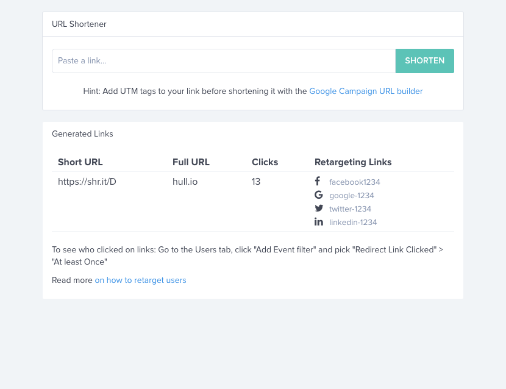

# URL Shortener

Imagine being able to retarget anybody who clicks on your links and having their profiles linked to your customer profiles and the visitors of your website.
The Hull Shortener lets you serve specific ads on Facebook, Twitter, LinkedIn & Adwords to those audiences. 

- Serve specific ads on Facebook, Twitter, LinkedIn & Google to everyone who clicked on a link.

- Create short urls that redirect to your content, tracking clicks in the User's profiles, whitelist 3rd party cookies for your tracking domain and lets you retarget customers on Facebook, Twitter, Linkedin and Google.

1. Create Short link.
2. Share link on Social media and in emails
3. Retarget on Ad Platforms and add to their Customer Journey log.

## What happens when a user clicks one of your links:

- The 3rd party cookie restriction for tracking will be removed for their Hull Tracking
- A `Redirect Link Clicked` event will be added to their user profile
- They will be added to a custom audience on Facebook, Twitter, Linkedin and Google so you can retarget them.

## How do I setup my Pixels ?

Easy. Go to the Settings tab, just enter your Pixel IDs for each of the networks and generate some short links. Now anyone who clicks those links can be retargeted in Facebook, LinkedIn, Twitter and Google. Easy!

## How do I create a custom audience ?

Easy too!

- On Facebook, go to your Facebook Ads Manager, then click "Create Audience"
- Filter the audience like this: "URL" > "Contains" > "shr.it". You can be more precise by filtering to the exact link you shared if needed.
- Click "Create Audience"

Done. Your audience is live and will stay updated!
You can now retarget them as needed.
